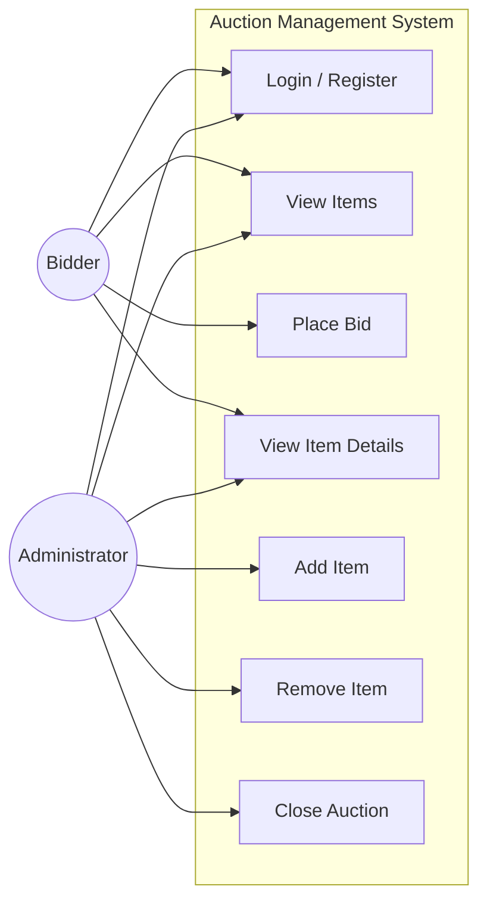
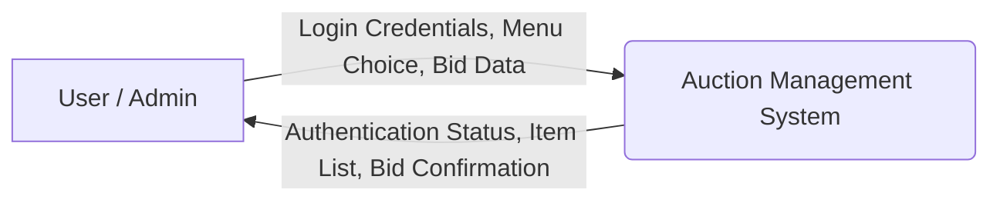
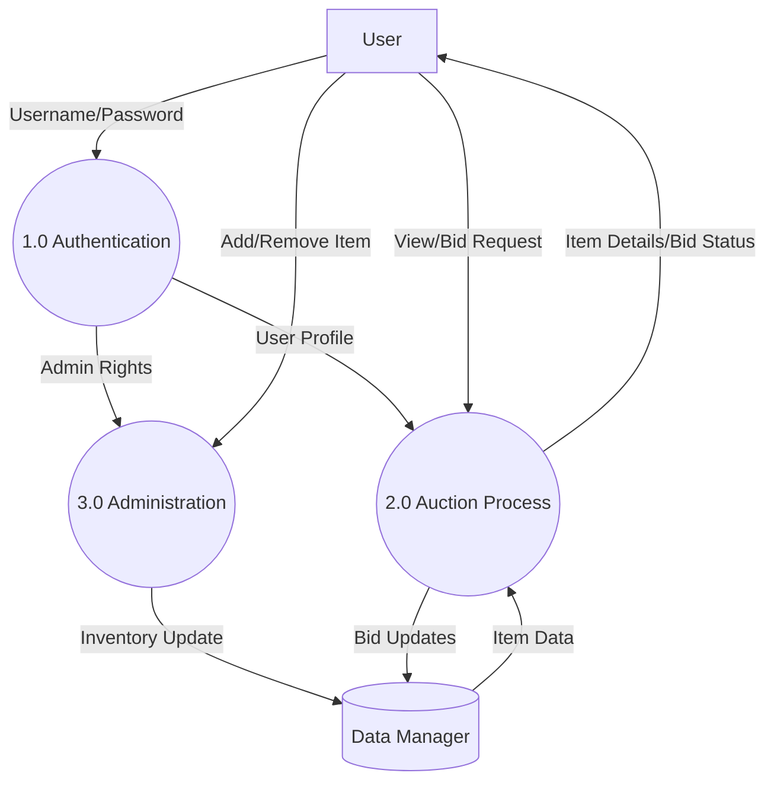
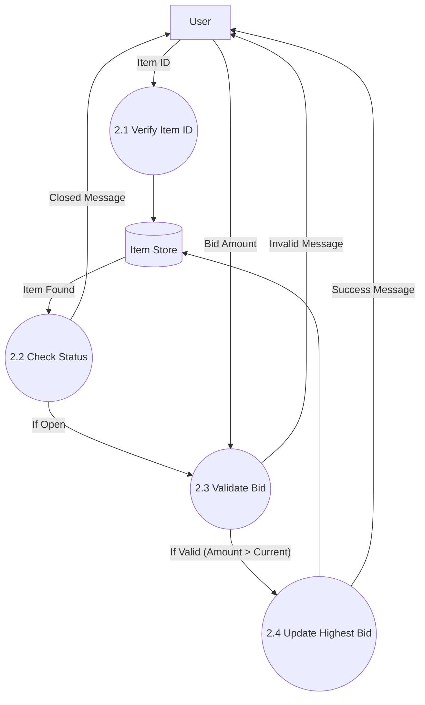

# SOFTWARE REQUIREMENT SPECIFICATION (SRS)

**Project Title:** Auction Management System Studio (AMSS)  
**Domain:** Console-based Desktop Application  
**End Users:** Bidders, Administrators  
**Technology Stack:** Java (JDK)  
**Academic Level:** Undergraduate (Semester Project)

---

## 1. INTRODUCTION

### 1.1 Purpose
The purpose of this document is to present a detailed description of the **Auction Management System Studio**. It explains the purpose and features of the system, the interfaces of the system, what the system will do, and the constraints under which it must operate. This document is intended for the stakeholders and developers of the system.

### 1.2 Scope
The **Auction Management System** is a Java-based console application designed to digitize the auction process. It allows users to register, view items (Electronics, Art, Furniture), and place bids in real-time. It provides administrators with tools to manage the inventory (add/remove items) and close auctions to declare winners. The system aims to replace manual auction record-keeping with an automated, reliable digital solution.

### 1.3 Glossary
- **Bidder**: A registered user who can place bids on items.
- **Admin**: A privileged user who can manage items and close auctions.
- **Item**: A product available for auction (e.g., Electronics, Art, Furniture).
- **Bid**: A financial offer placed by a user for a specific item.
- **Console**: The text-based user interface where the application runs.

### 1.4 Overview
The rest of this document contains the Overall Description of the software product, the specific Requirements Specification including functional and non-functional requirements, and System Diagrams (Use Case and DFDs) to visualize the system architecture.

---

## 2. OVERALL DESCRIPTION

### 2.1 Problem Statement
Traditional auction systems often rely on physical presence or manual record-keeping, which can be prone to errors, slow in processing, and geographically limited. Tracking the highest bid and ensuring bid validity (e.g., minimum increments) manually is inefficient and difficult to scale.

### 2.2 Existing System
Currently, the process is either entirely manual (paper-based) or relies on disjointed tools (spreadsheets) that do not enforce business logic (e.g., preventing a lower bid than the current highest).

### 2.3 Proposed System
The proposed **Auction Management System Studio** provides a centralized platform where:
- Users can view real-time item details and highest bids.
- The system automatically validates bids based on item rules (e.g., Art items require a 5% minimum increment).
- Administrators can dynamically manage the inventory without restarting the system.
- Auctions can be closed instantly, announcing the winner.

### 2.4 Product Functions
- **User Authentication**: Login and Registration for Bidders and Admins.
- **Item Management**: Admins can add new items (generating unique IDs) and remove items.
- **Bidding System**: Users can place bids with validation logic.
- **View Catalog**: Users can view all open items and their current status.
- **Auction Closure**: Admins can finalize an auction and determine the winner.

### 2.5 User Characteristics
#### 2.5.1 User Requirements
- Access to a computer with a Java Runtime Environment (JRE).
- Basic familiarity with command-line interactions.

#### 2.5.2 User Education Level
- **Bidder**: Minimal technical knowledge required.
- **Admin**: Basic understanding of inventory management concepts.

#### 2.5.3 User’s Technical Expertise
- Low to Medium. The system uses a simple menu-driven interface to minimize complexity.

### 2.6 Constraints
- The system runs in a console/terminal environment.
- Data is non-persistent (stored in memory) for this version of the project.
- Single-user interaction simulation (since it is a console app, "concurrent" users are simulated sequentially or the app is intended for a single terminal at a time).

### 2.7 Assumptions and Dependencies
- The host machine has a compatible OS (Windows/Linux/macOS) with Java installed.
- The user inputs data in the correct format when prompted (though the system handles invalid types).

---

## 3. REQUIREMENT SPECIFICATION

### 3.1 Functional Requirements

#### 3.1.1 Performance Requirements
- The system shall respond to user inputs (menu selections) instantly (< 1 second).
- ID generation for new items shall be instantaneous and collision-free.

#### 3.1.2 Design Constraints
- The UI must be text-based using standard output streams.
- The system must use Object-Oriented principles (Inheritance, Polymorphism) for Item types.

#### 3.1.3 Hardware Requirements
- **Processor**: 1 GHz or faster.
- **RAM**: 512 MB minimum.
- **Storage**: < 10 MB for application files.

#### 3.1.4 Software Requirements
- **OS**: Windows 10/11, macOS, or Linux.
- **Language**: Java (JDK 8 or higher).

#### 3.1.5 Other Requirements
- **Input Validation**: The system must reject non-numeric input for prices and IDs to prevent crashes.

### 3.2 Non-Functional Requirements

#### 3.2.1 Security
- Passwords are required for login (stored in memory).
- Admin features (Add/Remove Item, Close Auction) must be restricted to users with the `isAdmin` flag.

#### 3.2.2 Reliability
- The system should not crash upon invalid user input (e.g., entering text where a number is expected).
- Bids must be strictly validated to ensure the price never decreases.

#### 3.2.3 Availability
- The system is available as long as the application process is running.

#### 3.2.4 Maintainability
- The code is modular (User, Item, AuctionManager, Main) allowing for easy updates to specific modules without affecting the whole system.

#### 3.2.5 Supportability
- The system provides clear error messages (`>> ERROR: ...`) to assist users in correcting mistakes.

---

## 4. DIAGRAMS

### 4.1 Use Case Diagram

### 4.2 Data Flow Diagram (DFD)

#### 4.2.1 Level-0 DFD (Context Diagram)

#### 4.2.2 Level-1 DFD

#### 4.2.3 Level-2 DFD (Process 2.0: Auction Process)

---

## 5. CONCLUSION
The **Auction Management System Studio** successfully digitizes the core functionalities of an auction house. By leveraging Object-Oriented Programming, it provides a robust, scalable, and user-friendly console interface. The system ensures data integrity through strict validation of bids and secure access control for administrative tasks, meeting the primary objectives of the semester project.

## 6. SCOPE OF THE PROJECT
This project is currently limited to a console-based environment with volatile memory storage. Future enhancements could include:
- **Database Integration**: Using SQL to persist users and items.
- **GUI**: Developing a graphical interface using JavaFX or a web frontend.
- **Network Support**: Enabling multiple users to bid concurrently across a network.
