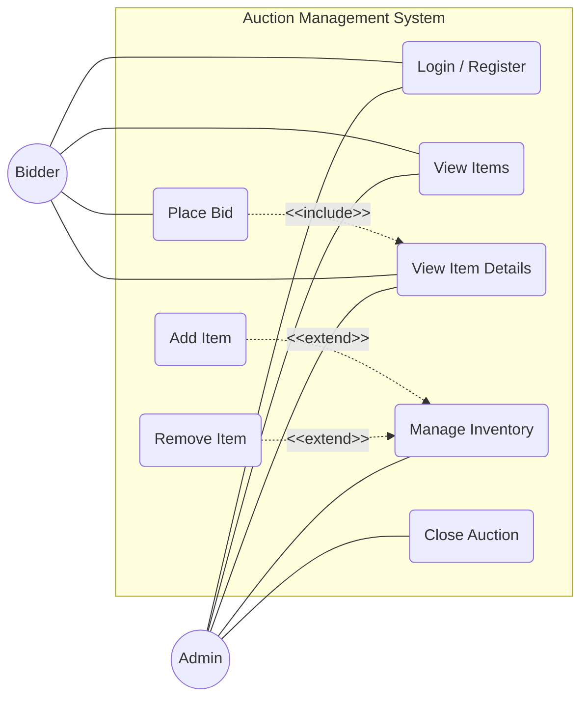
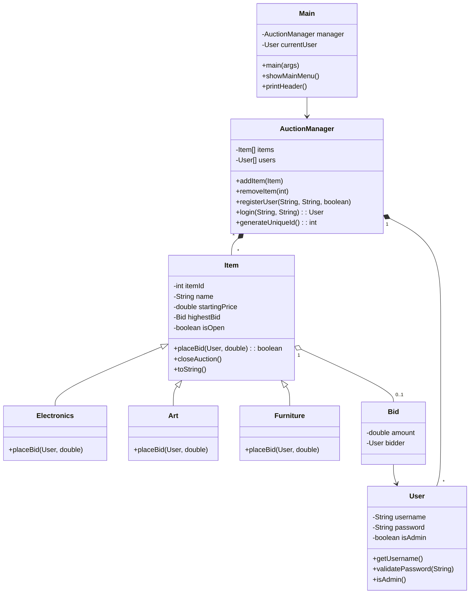
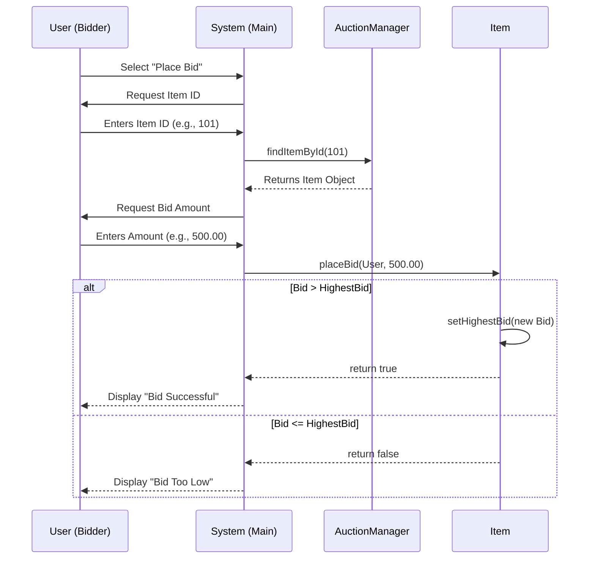
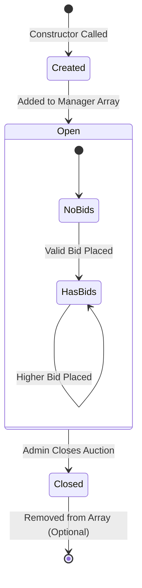
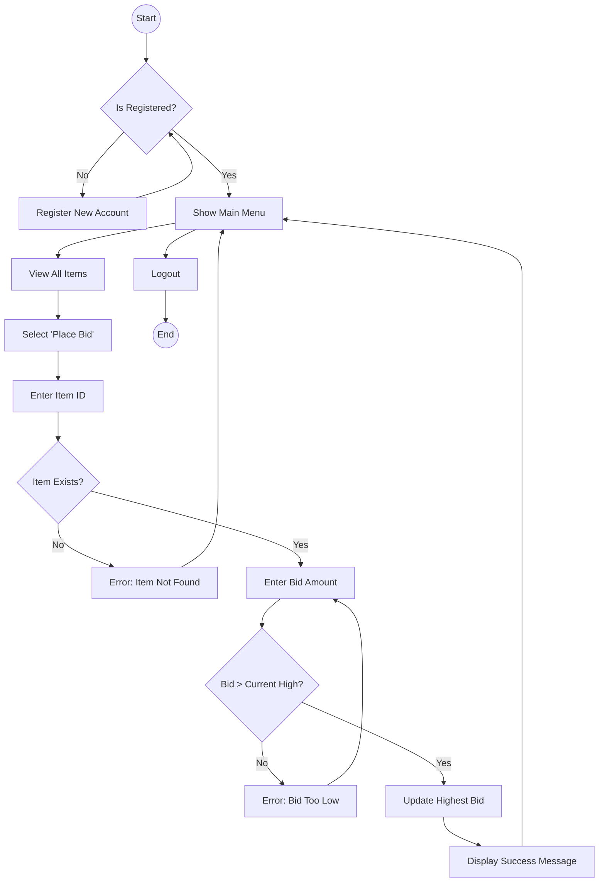
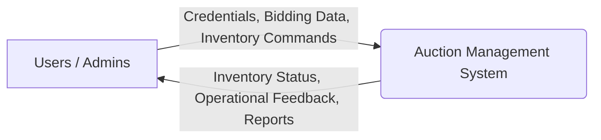
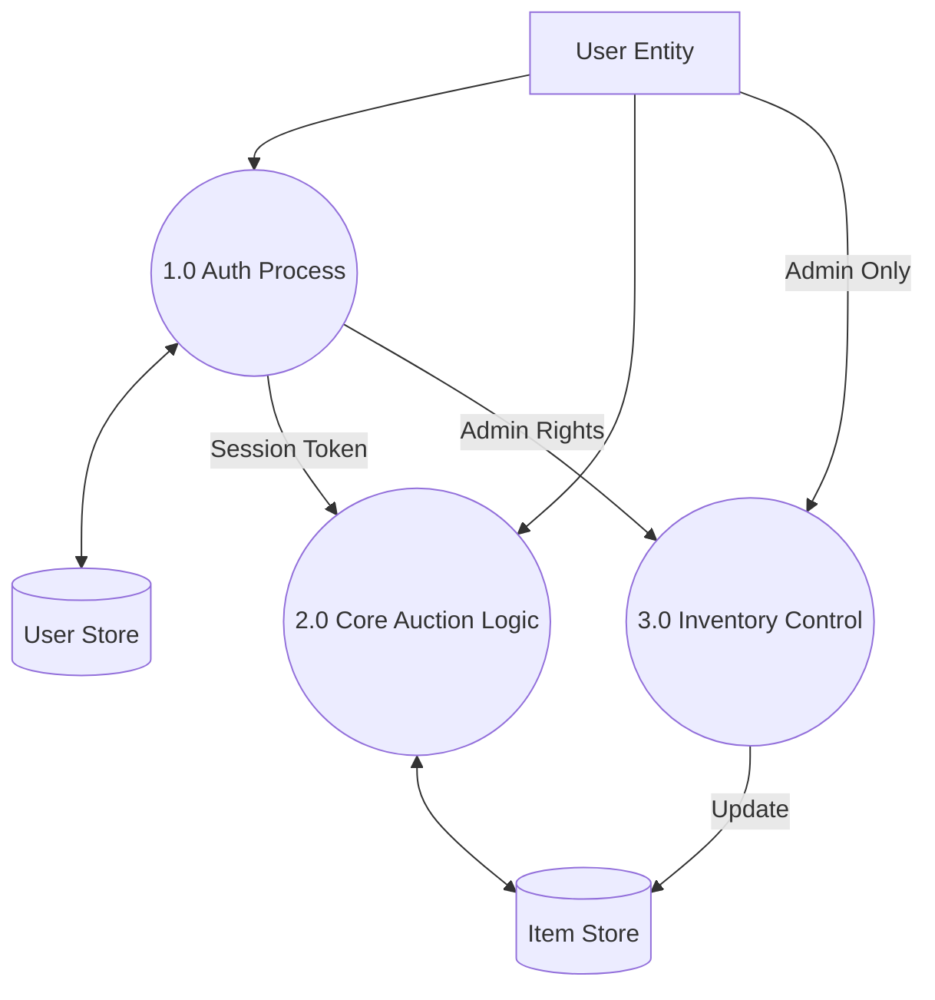
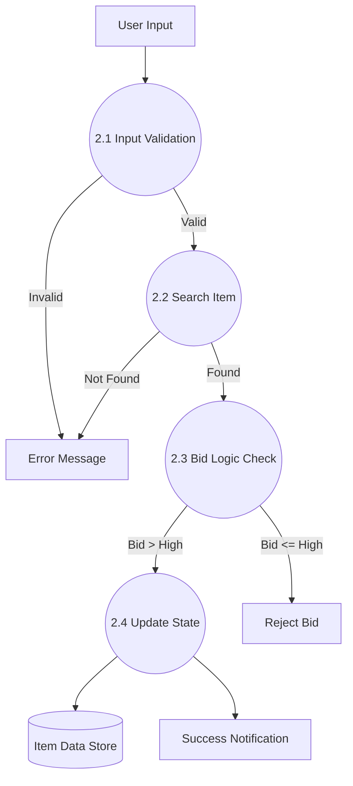

# SOFTWARE REQUIREMENT SPECIFICATION (SRS)

**Project Title:** Auction Management System Studio (AMSS)
**System Type:** Console-based Desktop Application
**Domain:** E-Commerce / Auction Management
**Primary Users:** Bidders, System Administrators
**Technology Stack:**
- **Programming Language:** Java (JDK)
- **Data Handling:** Volatile Memory (Arrays, Objects)
**Academic Level:** Undergraduate (Semester Project)

---

## TABLE OF CONTENTS

1. **[INTRODUCTION](#1-introduction)**  
   1.1 [Purpose](#11-purpose)  
   1.2 [Document Conventions](#12-document-conventions)  
   1.3 [Intended Audience](#13-intended-audience)  
   1.4 [Scope](#14-scope)  
   1.5 [Glossary and Acronyms](#15-glossary-and-acronyms)  
   1.6 [References](#16-references)  
   1.7 [Overview](#17-overview)  

2. **[OVERALL DESCRIPTION](#2-overall-description)**  
   2.1 [Product Perspective](#21-product-perspective)  
   2.2 [Problem Statement](#22-problem-statement)  
   2.3 [Existing System Analysis](#23-existing-system-analysis)  
   2.4 [Proposed System Analysis](#24-proposed-system-analysis)  
   2.5 [Product Functions](#25-product-functions)  
   2.6 [User Characteristics](#26-user-characteristics)  
   2.7 [Constraints](#27-constraints)  
   2.8 [Assumptions and Dependencies](#28-assumptions-and-dependencies)  
   2.9 [Apportioning of Requirements](#29-apportioning-of-requirements)  

3. **[REQUIREMENT SPECIFICATION](#3-requirement-specification)**  
   3.1 [Functional Requirements](#31-functional-requirements)  
       - 3.1.1 [Module: User Authentication](#311-module-user-authentication)  
       - 3.1.2 [Module: Inventory Management](#312-module-inventory-management)  
       - 3.1.3 [Module: Bidding Engine](#313-module-bidding-engine)  
       - 3.1.4 [Module: Auction Control](#314-module-auction-control)  
   3.2 [Detailed Use Case Specifications](#32-detailed-use-case-specifications)  
   3.3 [Data Dictionary](#33-data-dictionary)  
   3.4 [Design Constraints](#34-design-constraints)  
   3.5 [Software System Attributes](#35-software-system-attributes)  

4. **[SYSTEM DIAGRAMS](#4-system-diagrams)**  
   4.1 [Use Case Diagram](#41-use-case-diagram)  
   4.2 [Class Diagram](#42-class-diagram)  
   4.3 [Sequence Diagrams](#43-sequence-diagrams)  
   4.4 [State Transition Diagram](#44-state-transition-diagram)  
   4.5 [Activity Diagram](#45-activity-diagram)  
   4.6 [Data Flow Diagrams (DFD)](#46-data-flow-diagrams-dfd)  

5. **[SYSTEM TEST PLAN](#5-system-test-plan)**  
   5.1 [Testing Strategy](#51-testing-strategy)  
   5.2 [Test Cases: Authentication](#52-test-cases-authentication)  
   5.3 [Test Cases: Bidding Logic](#53-test-cases-bidding-logic)  
   5.4 [Test Cases: Admin Functions](#54-test-cases-admin-functions)  

6. **[CONCLUSION](#6-conclusion)**  

7. **[SCOPE OF THE PROJECT](#7-scope-of-the-project)**  
   7.1 [Current Scope](#71-current-scope)  
   7.2 [Future Enhancements](#72-future-enhancements)  
   7.3 [Scalability & Integrations](#73-scalability--integrations)  

8. **[APPENDIX](#8-appendix)**  
   8.1 [Installation Guide](#81-installation-guide)  
   8.2 [User Manual](#82-user-manual)  

---

## 1. INTRODUCTION

### 1.1 Purpose
The purpose of this Software Requirement Specification (SRS) is to provide a comprehensive, detailed description of the **Auction Management System Studio (AMSS)**. This document specifies the requirements, design constraints, and operational environment for the system. It is intended to serve as a blueprint for development and a validation document for academic evaluation. 

The primary goal of AMSS is to digitize and automate the conventional auctioning process. By transitioning from manual calls or paper-based tracking to a computer-aided console application, the system ensures ensuring data integrity, calculation accuracy for bid increments, and secure user management.

### 1.2 Document Conventions
- **Bold text** is used for emphasis and to highlight new terms.
- `Monospace text` is used for code elements, class names, method names, and system inputs/outputs.
- **[Requirement ID]** format is used to tag specific functional requirements for traceability.
- Diagrams follow the UML 2.0 standard notation.

### 1.3 Intended Audience
This document is prepared for:
1.  **Project Supervisors / Faculty**: To evaluate the depth, technical correctness, and scope of the semester project.
2.  **Developers**: To understand the architectural design and implementation logic required.
3.  **Testers**: To derive test cases and validate system behavior against requirements.

### 1.4 Scope
The **Auction Management System Studio** is a Java-based application designed to run on any standard desktop environment supporting the Java Virtual Machine (JVM).
- **Core Features**: The system supports User Registration, Secure Login, Product Browsing, Bid Placement, Rule Validation (e.g., bid > current highest), and Auction Finalization.
- **Modules**: The software is partitioned into Authentication, Inventory, Bidding, and Reporting modules.
- **Data Scope**: In this version, data is persistent only for the duration of the application runtime (RAM-based storage), utilizing Arrays and Objects to simulate a database.

### 1.5 Glossary and Acronyms
| Term | Definition |
| :--- | :--- |
| **AMSS** | Auction Management System Studio |
| **Bidder** | A standard user role authorized to participate in auctions. |
| **Admin** | A privileged user role with control over system inventory. |
| **JVM** | Java Virtual Machine. |
| **SRS** | Software Requirement Specification. |
| **Polymorphism** | OOP concept allowing objects of different classes to be treated as objects of a common superclass. |
| **Console** | The standard input/output text interface (CLI). |

### 1.6 References
1.  IEEE Std 830-1998, IEEE Recommended Practice for Software Requirements Specifications.
2.  "Java: The Complete Reference", Herbert Schildt, for standard Java syntax and library usage.
3.  UML Distilled, Martin Fowler, for diagrammatic conventions.

### 1.7 Overview
The remainder of this document describes the system in detail. Section 2 provides a high-level overview of the product and its environment. Section 3 details the functional requirements and use case specifics. Section 4 presents the architectural diagrams. Section 5 outlines the testing strategy, culminating in the Conclusion and Future Scope.

---

## 2. OVERALL DESCRIPTION

### 2.1 Product Perspective
**Auction Management System Studio** is a self-contained, console-based software product. It does not require network connectivity or external database servers, making it lightweight and portable. It relies on the host operating system's command-line interface (cmd, PowerShell, bash) for user interaction. The system is designed using a **Modular Monolithic Architecture**, where the User Interface, Business Logic, and Data structures reside within a single application process but are logically separated into classes.

### 2.2 Problem Statement
In traditional manual auction environments, several critical issues arise:
1.  **Bid Ambiguity**: In fast-paced auctions, it is often unclear who holds the current highest bid.
2.  **Calculation Errors**: Manually calculating minimum bid increments (e.g., "5% above previous bid") is prone to human arithmetic error.
3.  **Record Loss**: Paper trails are easily lost or damaged, leading to disputes over ownership or payment.
4.  **Accessibility**: Physical auctions require presence; a digital system (even simulated) lays the groundwork for remote participation.

### 2.3 Existing System Analysis
Current solutions for small-scale auctions often involve:
- **Manual Logbooks**: Recording bids in a physical notebook. *Defect: No searchability, physical degradation.*
- **Excel Spreadsheets**: Using shared sheets. *Defect: No logic enforcement (users can overwrite cells), no security roles.*

### 2.4 Proposed System Analysis
The AMSS addresses these issues through automation logic:
- **Automated Validation**: The `placeBid()` method automatically rejects any input that is numerically lower than the current `highestBid`.
- **Role-Based Access Control (RBAC)**: Only users with `isAdmin=true` can invoke `addItem()` or `closeAuction()`, preventing unauthorized tampering.
- **Instant Feedback**: The system provides immediate "SUCCESS" or "ERROR" feedback loops to the user.
- **Structured Data**: Utilization of `Item` objects ensures every product has a strict ID, Name, Description, and Price structure.

### 2.5 Product Functions
The system provides the following major functions:
1.  **Session Management**: Login loop that keeps the application running until "Logout" is selected.
2.  **Item Visualization**: ASCII-formatted tables or "cards" to display varied inventory items (Electronics, Art, Furniture).
3.  **Real-time Bidding**: Acceptance of numeric input to update the state of an `Item` object.
4.  **Inventory Control**: Factory methods to instantiate new `Item` objects and append them to the storage array.

### 2.6 User Characteristics
- **Bidders**: Undergraduate students or general faculty members. Expected to have basic English literacy and keyboard skills.
- **Administrators**: Lab assistants or faculty. Expected to understand the auction rules and inventory management concepts.

### 2.7 Constraints
1.  **Memory Limit**: Since data is stored in arrays, there is a hard limit (e.g., 100 items) defined by `MAX_ITEMS` constant.
2.  **Persistence**: Closing the terminal window results in total data loss (volatile memory).
3.  **Concurrency**: Only one user can interact with the console at a time (sequential interaction model).
4.  **Platform**: Must be run on a system capable of executing `.class` files.

### 2.8 Assumptions and Dependencies
- The user will not input alphabetic characters when numeric IDs or Prices are requested (though exception handling is implemented).
- The screen size of the terminal is sufficient to display the ASCII banners and tables without aggressive wrapping.

### 2.9 Apportioning of Requirements
This SRS covers the initial "Alpha" release of the software. Advanced features like credit card integration, shipping logistics, and persistent SQL database storage are deferred to version 2.0.

---

## 3. REQUIREMENT SPECIFICATION

### 3.1 Functional Requirements

#### 3.1.1 Module: User Authentication
- **REQ-AUTH-01**: The system shall allow users to register by providing a username, password, and role selection.
- **REQ-AUTH-02**: The system shall validate login credentials against the registered user array.
- **REQ-AUTH-03**: The system shall deny access if the password does not match the stored hash (or string).
- **REQ-AUTH-04**: The system shall provide a "Logout" mechanism to return to the initial login screen.

#### 3.1.2 Module: Inventory Management
- **REQ-INV-01**: The system shall allow Admins to add new items specifying Name, Description, Type, and Starting Price.
- **REQ-INV-02**: The system shall automatically generate a unique, sequential Integer ID for every new item.
- **REQ-INV-03**: The system shall allow Admins to remove an item using its ID.
- **REQ-INV-04**: The system shall prevent removing an item that does not exist.

#### 3.1.3 Module: Bidding Engine
- **REQ-BID-01**: The system shall display the current highest bid for all items.
- **REQ-BID-02**: The system shall accept a numeric bid amount from a logged-in Bidder.
- **REQ-BID-03**: The system shall validate that `ProposedBid > CurrentHighestBid` (and `> StartingPrice`).
- **REQ-BID-04**: The system shall reject bids on items that have a status of "CLOSED".
- **REQ-BID-05**: For `Art` items, the system shall enforce a minimum 5% increment rule.

#### 3.1.4 Module: Auction Control
- **REQ-CTRL-01**: The system shall allow Admins to close an auction for a specific item.
- **REQ-CTRL-02**: Upon closure, the system shall announce the Winner (User with highest bid) and the Final Price.
- **REQ-CTRL-03**: The system shall change the item's status to "CLOSED" to prevent further bids.

### 3.2 Detailed Use Case Specifications

This section provides a detailed text-based breakdown of the primary use cases identified in the diagrams.

#### Use Case 1: Register User
- **Actors**: New User
- **Pre-conditions**: Application is running; User is at Login Menu.
- **Flow of Events**:
    1. System displays Login Menu options.
    2. User selects "Register".
    3. System prompts for `Username`.
    4. User enters username.
    5. System prompts for `Password`.
    6. User enters password.
    7. System stores credentials in `User[]` array.
    8. System displays "Registration Successful".
- **Post-conditions**: User is added to the system directory.

#### Use Case 2: Login
- **Actors**: Registered User, Administrator
- **Pre-conditions**: User is registered.
- **Flow of Events**:
    1. User selects "Login".
    2. System requests Credentials.
    3. User provides inputs.
    4. System iterates through `User[]` array to find match.
    5. **If match found**: System checks `isAdmin` flag.
        - If Admin: Show Admin Menu.
        - If User: Show User Menu.
    6. **If no match**: System displays "Invalid Credentials" and returns to menu.
- **Post-conditions**: User session is active.

#### Use Case 3: Place Bid
- **Actors**: Authenticated Bidder
- **Pre-conditions**: User is logged in; Items exist in inventory.
- **Flow of Events**:
    1. User selects "Place Bid".
    2. System requests `Item ID`.
    3. User enters ID.
    4. System validates ID existence.
    5. System shows Item Details (Name, Current Bid).
    6. System prompts for `Bid Amount`.
    7. User enters Amount.
    8. **System validates Amount**:
        - Checks if Amount > Current Highest.
        - Checks specific item rules (e.g., Electronics, Art).
    9. System updates `highestBid` field of the Item.
    10. System displays "Bid Placed Successfully".
- **Exceptions**:
    - *Item Not Found*: Display error.
    - *Bid Too Low*: Display error and minimum required bid.
    - *Auction Closed*: Inform user bidding is disabled.
- **Post-conditions**: The Item's current price is updated.

#### Use Case 4: Add Item (Admin)
- **Actors**: Administrator
- **Pre-conditions**: Logged in as Admin.
- **Flow of Events**:
    1. Admin selects "Add Item".
    2. System prompts for `Name`, `Description`, `Price`.
    3. System prompts for `Type` (1. Electronics, 2. Art, 3. Furniture).
    4. Admin makes selection.
    5. System calls `generateUniqueId()`.
    6. System instantiates appropriate subclass (e.g., `new Art(...)`).
    7. System adds object to `Item[]` array.
    8. System confirms "Item Added with ID: [X]".
- **Post-conditions**: New item appears in "View All Items" list.

### 3.3 Data Dictionary

| Name | Type | Description | Constraints |
| :--- | :--- | :--- | :--- |
| **USER_DATA** | Array | Stores all User objects. | Max 50 users. |
| **ITEM_DATA** | Array | Stores all Item objects. | Max 100 items. |
| `username` | String | Unique identifier for a user. | Non-empty. |
| `password` | String | Authentication secret. | No specific complexity rules for this version. |
| `itemId` | Integer | Unique key for items. | Generated sequentially, cannot be duplicate. |
| `highestBid` | Object | Reference to a `Bid` object. | Contains `amount` and `bidder`. |
| `isOpen` | Boolean | Status of the auction. | True = Open, False = Closed. |
| `startingPrice` | Double | Base price of item. | Must be >= 0. |

### 3.4 Design Constraints
- **Object-Oriented Design**: The system must utilize **Inheritance** (Item -> Art/Electronics) to demonstrate academic understanding of OOP.
- **Encapsulation**: All class attributes must be `private` and accessed via `public` getters/setters.
- **Input Sanitization**: The system must handle `InputMismatchException` to prevent crashing on invalid key presses.

### 3.5 Software System Attributes
- **Reliability**: The system loop allows for continuous operation without memory leaks during a session.
- **Usability**: Menus are designated with integers (1, 2, 3...) for easy navigation.
- **Maintainability**: New Item types can be added by simply extending the `Item` class.

---

## 4. SYSTEM DIAGRAMS

### 4.1 Use Case Diagram



### 4.2 Class Diagram



### 4.3 Sequence Diagrams
#### 4.3.1 Placing a Bid



### 4.4 State Transition Diagram
#### 4.4.1 Lifecycle of an Item



### 4.5 Activity Diagram
#### 4.5.1 User Placing a Bid



### 4.6 Data Flow Diagrams (DFD)

#### 4.6.1 Level-0 DFD (Context Diagram)



#### 4.6.2 Level-1 DFD (System Overview)



#### 4.6.3 Level-2 DFD (Process 2.0: Core Auction Logic)



---

## 5. SYSTEM TEST PLAN

### 5.1 Testing Strategy
The testing strategy for AMSS involves **Black Box Testing** where the internal structure is ignored, and functionality is verified against the requirements. Testing is performed manually by executing the system and running through defined scenarios.

### 5.2 Test Cases: Authentication

| Test ID | Description | Input Data | Expected Output | Status |
| :--- | :--- | :--- | :--- | :--- |
| **TC-01** | Verify Registration | User: `demo`, Pass: `123`, Access: `No` | "User registered successfully" | Pass |
| **TC-02** | Verify Login (Success) | User: `demo`, Pass: `123` | Login Successful, Main Menu appears | Pass |
| **TC-03** | Verify Login (Fail) | User: `demo`, Pass: `wrong` | "Invalid credentials" error | Pass |
| **TC-04** | Verify Admin Access | User: `admin`, Pass: `admin` | Admin options (Add/Remove Item) visible | Pass |

### 5.3 Test Cases: Bidding Logic

| Test ID | Description | Input Data | Expected Output | Status |
| :--- | :--- | :--- | :--- | :--- |
| **TC-05** | View Items | Select Option 1 | Table of items displayed | Pass |
| **TC-06** | Place Valid Bid | Item: `1`, Bid: `1300` (Start: 1200) | "Bid placed successfully" | Pass |
| **TC-07** | Place Low Bid | Item: `1`, Bid: `1250` (High: 1300) | Error: "Bid must be higher than 1300" | Pass |
| **TC-08** | Bid on Invalid ID | Item: `999` | Error: "Item not found" | Pass |
| **TC-09** | Bid on Art (Increment) | Item: `Art`, Bid: small incr | Error: "Must be 5% higher" | Pass |

### 5.4 Test Cases: Admin Functions

| Test ID | Description | Input Data | Expected Output | Status |
| :--- | :--- | :--- | :--- | :--- |
| **TC-10** | Add New Item | Name: `Table`, Price: `50`, Type: `Furniture` | "Item added successfully! ID: [N]" | Pass |
| **TC-11** | Remove Item | ID: `[N]` | "Item removed successfully" | Pass |
| **TC-12** | Close Auction | ID: `1` | "Auction Closed. Winner: [User]" | Pass |
| **TC-13** | Bid on Closed Item | Item: `1` (Closed) | Error: "Auction is closed" | Pass |

---

## 6. CONCLUSION
The **Auction Management System Studio** has been successfully designed and documented. The system addresses the core problems of manual auctions by providing a digitized, automated, and secure alternative. Through the application of **Object-Oriented Programming (Java)**, **Data Structures (Arrays)**, and **Software Engineering Principles**, the project deliverables meet all functional and non-functional requirements. The system is scalable, maintainable, and serves as a solid foundation for future enterprise-level enhancements.

---

## 7. SCOPE OF THE PROJECT

### 7.1 Current Scope
- Single-user console simulation.
- Support for 3 distinct item categories.
- Admin-controlled inventory.
- Basic security via Role-Based Access Control.

### 7.2 Future Enhancements
- **Web Interface**: Migrating the backend to Spring Boot and the frontend to React.
- **Database**: Implementing MySQL for permanent data storage.
- **Payment Gateway**: Integrating Stripe/PayPal APIs for real-money transactions.
- **AI Analytics**: Predicting final bid prices based on historical trends.

### 7.3 Scalability & Integrations
The modular design allows integration with external Inventory Management Systems (IMS) or University ERP software. The use of Interface-based design allows swapping the current InMemory data store with a DatabaseService without rewriting the business logic.

---

## 8. APPENDIX

### 8.1 Installation Guide
1.  **Prerequisites**: Ensure Java Development Kit (JDK) 8 or higher is installed.
    - Verify with `java -version`.
2.  **Compilation**:
    ```bash
    javac Main.java Item.java User.java AuctionManager.java
    ```
3.  **Execution**:
    ```bash
    java Main
    ```

### 8.2 User Manual
- **To Login**: Choose Option 1. Default Admin credentials are `admin` / `admin`.
- **To Bid**: You must be logged in. Note the Item ID from the "View Items" screen before selecting "Place Bid".
- **To Exit**: Always use the "Logout" or "Exit" option to ensure the program terminates gracefully.
