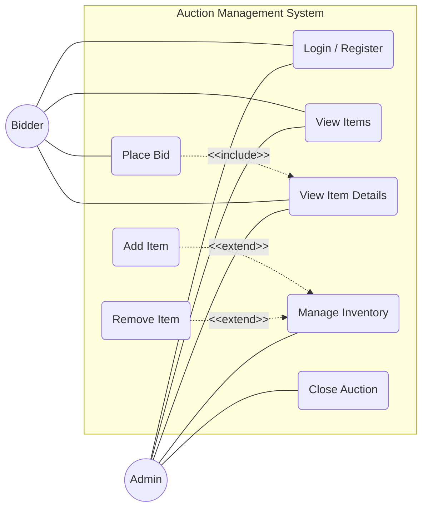
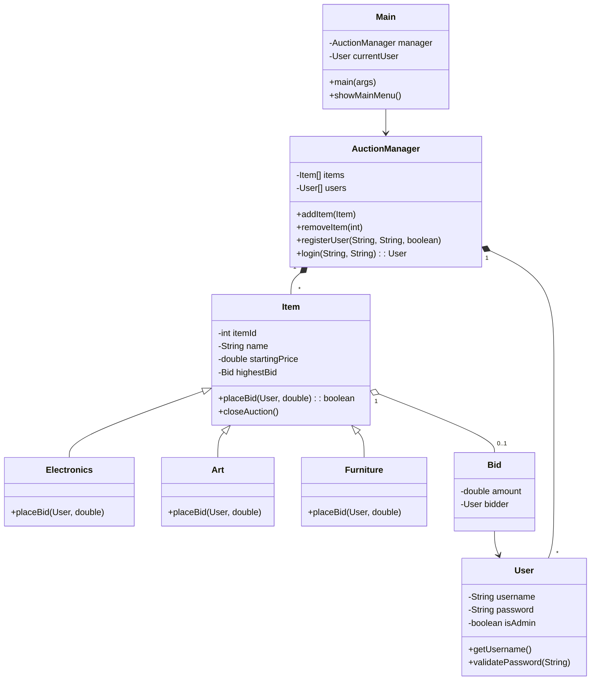
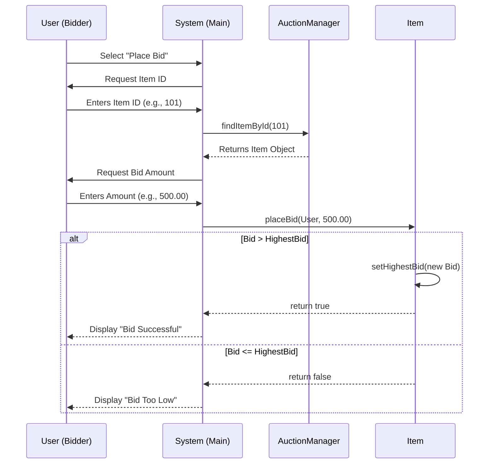
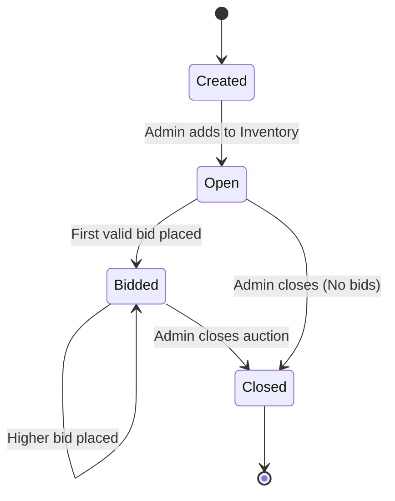
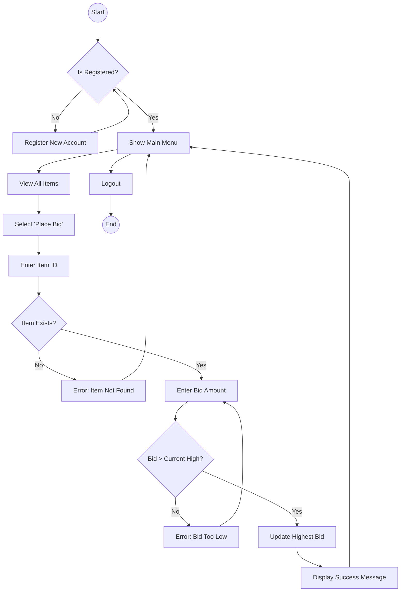
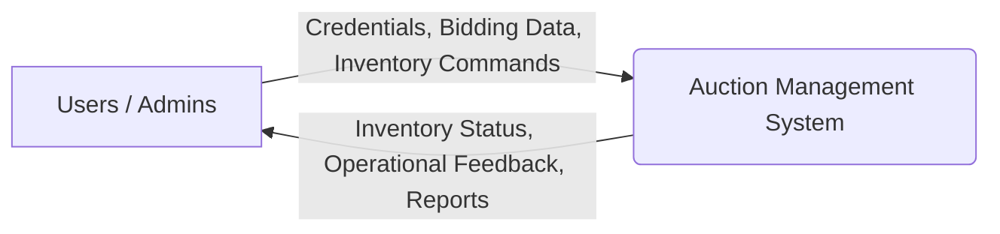
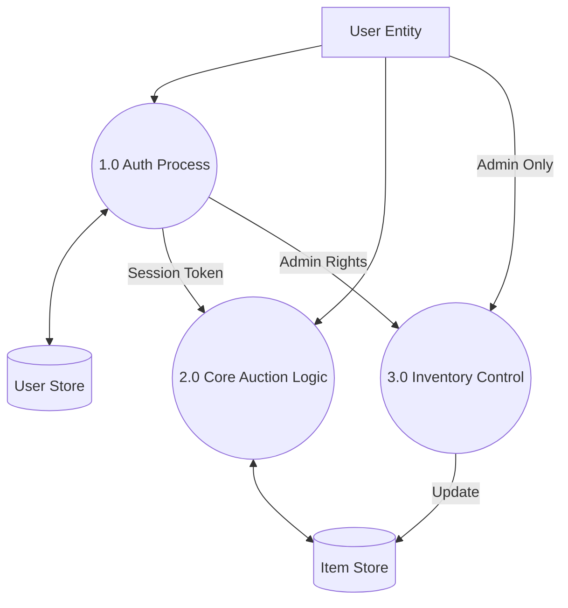
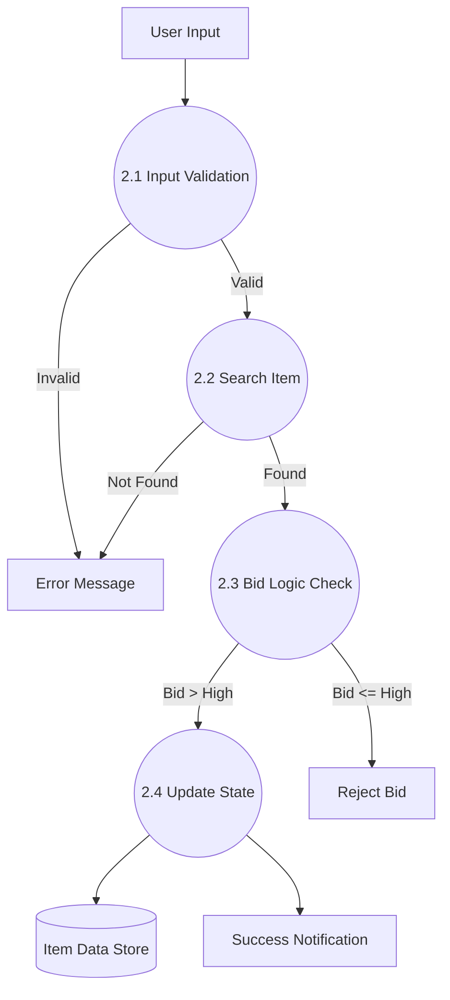

# SOFTWARE REQUIREMENT SPECIFICATION (SRS)

**Project Title:** Auction Management System Studio (AMSS)
**System Type:** Console-based Desktop Application
**Domain:** E-Commerce / Auction Management
**Primary Users:** Bidders, System Administrators
**Technology Stack:**
- **Programming Language:** Java (JDK)
- **Data Handling:** Volatile Memory (Arrays, Objects)
**Academic Level:** Undergraduate (Semester Project)

---

## 1. INTRODUCTION

### 1.1 Purpose
The primary purpose of the **Auction Management System Studio (AMSS)** is to simulate a digital auction environment. The system aims to automate the traditional manual bidding process, ensuring transparency, accuracy, and real-time bid validation. By digitizing the auction workflow, the system eliminates human error associated with manual record-keeping and provides an efficient platform for potential buyers to compete for items such as electronics, art, and furniture.

### 1.2 Scope
The scope of the project encompasses the development of a Java-based application that facilitates the entire lifecycle of an auction item. This includes:
- **User Authentication Module**: Secure login and registration for administrators and bidders.
- **Inventory Management Module**: Dynamic addition and removal of auction items by administrators.
- **Bidding Module**: Real-time bid placement with logic to enforce minimum increments and validate bid superiority.
- **Auction Control Module**: Administrative capability to close auctions and determine winners based on the highest valid bid.

Technical scope is limited to a single-terminal simulation using standard Java I/O for interaction. The system utilizes object-oriented principles to manage data structures in memory.

### 1.3 Glossary
- **Bidder**: A registered user authorized to place monetary bids on open auctions.
- **Admin**: A superuser with privileges to manage system inventory and finalize auctions.
- **Item**: An object (e.g., Laptop, Painting) instantiated within the system subject to bidding.
- **Bid**: A numerical value associated with a user, representing a purchase offer.
- **Increment**: The minimum amount by which a new bid must exceed the current highest bid.
- **Console/Terminal**: The text-based interface used for Input/Output operations.

### 1.4 Overview
The system is architected as a modular Java application. The `Main` class serves as the entry point, orchestrating user interaction via console menus. The `AuctionManager` acts as the controller, managing arrays of `User` and `Item` objects. The `Item` class and its subclasses (`Electronics`, `Art`, `Furniture`) utilize polymorphism to enforce specific bidding rules.

---

## 2. OVERALL DESCRIPTION

### 2.1 Product Perspective
The **Auction Management System Studio** is a standalone, terminal-based software solution. It is designed to replace manual auction ledgers or spreadsheet-based tracking systems. Unlike networked solutions, this version simulates concurrent user activity through sequential logins on a single machine, focusing on logic validation and object state management.

### 2.2 Problem Statement
Traditional auction processes suffer from several inefficiencies:
- **Lack of Transparency**: Participants may not have real-time visibility of the current highest bid.
- **Human Error**: Manual calculation of minimum bid increments often leads to invalid bids being accepted.
- **Speed**: Physical or paper-based auctions are slow and require significant administrative overhead to determine winners.
- **Record Keeping**: Storing bid history on paper makes it difficult to audit or review past transactions.

### 2.3 Existing System
Current low-tech solutions typically involve manual bookkeeping or basic Excel spreadsheets.
- **Drawbacks**:
    - No automatic validation of rules (e.g., accepting a bid lower than the current price).
    - Hard to scale beyond a few items.
    - No security or separation of roles between bidders and auctioneers.
    - Vulnerable to data loss or tampering.

### 2.4 Proposed System
The proposed automation provides a structured digital environment.
- **Logic Implementation**: Uses `if-else` conditions to strictly validate that `newBid > currentBid`.
- **Data Structures**: Utilizes arrays to manage item catalogs and user registries.
- **Polymorphism**: Differentiates items (e.g., Art may require higher bid increments than Furniture).
- **Benefits**:
    - **Accuracy**: Eliminates calculation errors.
    - **Speed**: Instant updates of item status.
    - **Security**: Basic authentication protects administrative functions.

### 2.5 Product Functions
The system is divided into functional modules:
1.  **Authentication**: Verifies credentials against stored user objects.
2.  **Item Catalog**: Displays all items with their descriptions, prices, and status.
3.  **Bidding Engine**: Accepts input, validates magnitude against current high bid, and updates state.
4.  **Admin Console**: Allows creation (factory pattern logic) and deletion of items.

### 2.6 User Characteristics
#### 2.6.1 User Requirements
- Access to a standard PC keyboard and monitor.
- Ability to read English text prompts.

#### 2.6.2 User Education Level
- **Bidder**: No specific requirement; general literacy.
- **Admin**: High school diploma or equivalent; basic organizational skills.

#### 2.6.3 User’s Technical Expertise
- **Bidder/Admin**: Basic computer literacy (typing, navigating menus). No programming knowledge required.

### 2.7 Constraints
- **Technical**: Must run within the JVM (Java Virtual Machine).
- **Logical**: Data is non-persistent; restarting the application resets the state.
- **Institutional**: Designed for educational demonstration, not commercial transaction processing.
- **Security**: Passwords are stored in cleartext in memory (acceptable for this academic level).

### 2.8 Assumptions and Dependencies
- The executing machine has JDK 8 or higher installed.
- The user handles the console window appropriately (no resizing to extremes that break text formatting).

---

## 3. REQUIREMENT SPECIFICATION

### 3.1 Functional Requirements

#### 3.1.1 Performance Requirements
- **Response Time**: Menu transitions must occur in less than 0.5 seconds.
- **Accuracy**: Financial calculations must maintain precision to two decimal places.
- **Capacity**: The system is configured to handle up to 100 items and 50 users in memory using static array limits.
- **Error Handling**: Invalid inputs (e.g., strings for price) must be caught without crashing the JVM.

#### 3.1.2 Design Constraints
- **Language**: Strict usage of Java.
- **UI**: Text-based interface using ASCII formatting for "windows" and "cards".
- **Storage**: No external database; all data resides in runtime heap memory.

#### 3.1.3 Hardware Requirements
- **Processor**: Intel Core i3 or equivalent (context switching efficiency).
- **RAM**: 4GB distinct RAM (to support JVM overhead).
- **Input**: Standard QWERTY keyboard.

#### 3.1.4 Software Requirements
- **Operating System**: Platform independent (Windows 10+, Ubuntu 20.04+, macOS 12+).
- **Runtime**: JRE (Java Runtime Environment) 1.8+.
- **IDE**: VS Code (recommended) or Eclipse for development.

#### 3.1.5 Other Requirements
- **Documentation**: Source code must be commented for academic review.

### 3.2 Non-Functional Requirements

#### 3.2.1 Security
- Access to "Close Auction" and "Add Item" functions is strictly logically gated by the `isAdmin` boolean flag.

#### 3.2.2 Reliability
- The main event loop (`while(true)`) ensures the application remains active until explicitly exited.

#### 3.2.3 Availability
- The system is available immediately upon execution of the `.class` or `.jar` file.

#### 3.2.4 Maintainability
- Code is structured into separate files (`Main.java`, `Item.java`, `User.java`) facilitating isolated updates.

#### 3.2.5 Supportability
- The system outputs descriptive error codes and messages to standard output to aid in troubleshooting.

---

## 4. SYSTEM DIAGRAMS

### 4.1 Use Case Diagram

### 4.2 Class Diagram

### 4.3 Sequence Diagram (Placing a Bid)

### 4.4 State Diagram (Lifecycle of an Item)

### 4.5 Activity Diagram (User Placing a Bid)

### 4.6 Data Flow Diagrams (DFD)

#### 4.6.1 Level-0 DFD (Context Diagram)

#### 4.6.2 Level-1 DFD (System Overview)

#### 4.6.3 Level-2 DFD (Process 2.0: Core Auction Logic)

---

## 5. CONCLUSION
The **Auction Management System Studio** represents a significant step towards modernizing local auction processes. By implementing this system, the inefficiencies of manual bidding are effectively addressed through algorithmic validation and digital record-keeping. The system demonstrates the practical application of core Computer Science concepts, including Object-Oriented Design and Data Structures, fulfilling the academic requirements of the Software Engineering curriculum while providing a scalable foundation for future web-based iterations.

---

## 6. SCOPE OF THE PROJECT

### 6.1 Current Scope
The current iteration delivers a fully functional console application capable of handling multiple item types, user roles, and the complete bidding lifecycle within a single session.

### 6.2 Future Enhancements
- **Persistence**: Integration with a MySQL or SQLite database to retain data between sessions.
- **Graphical User Interface (GUI)**: Transitioning from console to JavaFX or Swing for a more user-friendly experience.
- **Reporting**: Advanced analytics for admins to view total revenue and popular items.
- **Networking**: Implementing Sockets to allow multiple users to bid simultaneously from different machines.

### 6.3 Scalability Considerations
While the current array-based implementation has fixed limits, the modular design allows for easy replacement of arrays with `ArrayLists` or Database connections to support thousands of items.

### 6.4 Integration Possibilities
The system's modular architecture (Item/User separation) makes it suitable for integration into larger e-commerce platforms or university inventory management systems.

### 6.5 Benefits and Impact
- **Educational**: Serves as a comprehensive case study for Object-Oriented Programming properties.
- **Operational**: Demonstrates how digital transformation reduces operational costs and time in auction scenarios.
